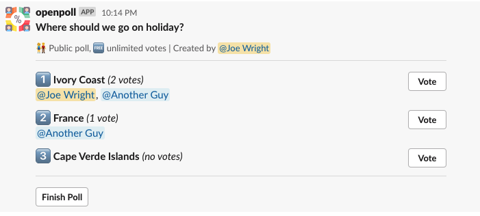

# Open Poll

This is a Slack Bot for running polls



# Running

You can bring up your own copy in AWS by:

```
export SLACK_CLIENT_ID='taken from the Slack api'
export SLACK_CLIENT_SECRET='taken from the Slack api'
npm install
npm deploy

```

This will give you output similar to:

```
Outputs:
OpenPollStack.ApiGatewayEndpoint5AA8EC3A = https://nyy3jdh1nd.execute-api.eu-west-2.amazonaws.com/prod/

Stack ARN:
arn:aws:cloudformation:eu-west-2:140551133576:stack/OpenPollStack/6ff86840-97ca-11ea-bb1c-029d9e7b7264
```

Take the URL shown by cdk and add it to Slack as the OAuth redirect URI like: https://nyy3jdh1nd.execute-api.eu-west-2.amazonaws.com/prod/oauth

Kick off an installation by going to https://nyy3jdh1nd.execute-api.eu-west-2.amazonaws.com/prod/install

# Design Principles

- Infrastructure as code (via CDK) over manul installs
- Serverless over long running processes
- Datensparsamkeit over storing data
- Open source over closed source

# Attributions


The logo is taken from https://www.flaticon.com/free-icon/polling_2633876?term=poll&page=1&position=6 which is "Icon made by Freepik from www.flaticon.com"
